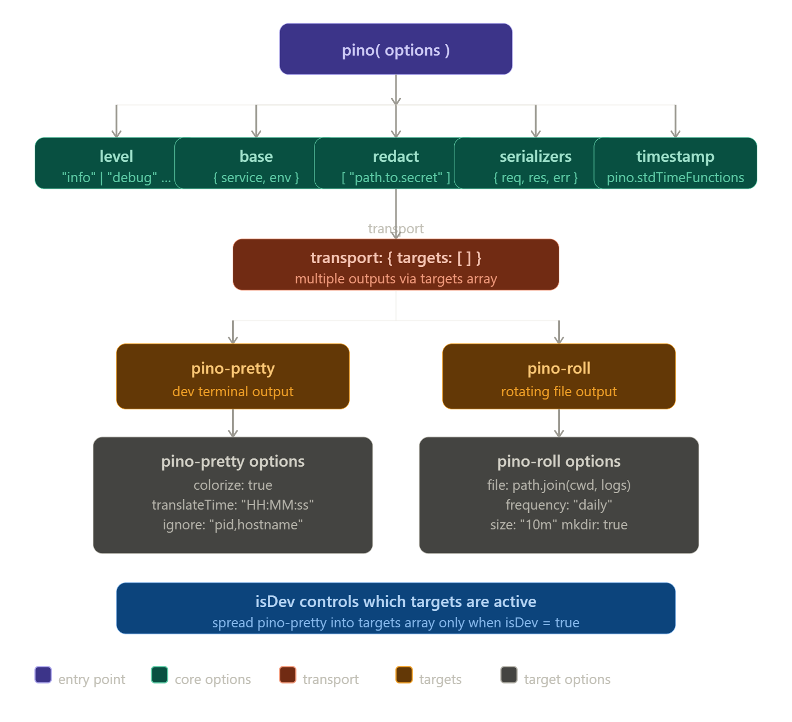

# Core Backend 
A production-grade backend service built with Node.js, Express, and TypeScript. Designed as a personal API infrastructure for authentication, data management, 
user control, and email services.

## Table of Contents

- [Overview](#overview)
- [Tech Stack](#tech-stack)
- [Logging](#logging)
- [Architecture & Key Features](#architecture--key-features)
- [Prerequisites](#prerequisites)
- [Environment Variables](#environment-variables)
- [Environment Variable Details](#environment-variable-details)
- [Installation & Setup](#installation--setup)
- [Running with Docker](#running-with-docker)
- [API Endpoints](#api-endpoints)
- [Project Structure](#project-structure)

## Overview
- **Multi-factor authentication** via JWT tokens and OAuth providers (Google, GitHub)
- **Distributed caching** using Redis for performance optimization
- **Transactional data persistence** with MongoDB Atlas Replica Sets
- **Email automation** with HTML templating and Nodemailer
- **Rate limiting** to protect API endpoints from abuse
- **Role-based access control** with Admin and Moderator roles
- **Request logging** and monitoring via Pino logger
- **Containerization** with Docker for seamless deployment

The system is designed to be horizontally scalable and cloud-ready.

## Tech Stack

| Category | Technology |
|----------|------------|
| **Runtime** | Node.js with TypeScript |
| **Framework** | Express.js 5.x |
| **Database** | MongoDB Atlas (Replica Set, Transactions) |
| **Cache** | Redis 5.x |
| **Authentication** | JWT, Passport.js (OAuth 2.0) |
| **Email Service** | Nodemailer with HTML templates |
| **Logging** | Pino with rolling file appender |
| **Rate Limiting** | express-rate-limit with Redis backend |
| **Security** | Bcrypt password hashing, CORS, Cookie Parser |
| **Validation** | Zod schema validation |
| **Containerization** | Docker & Docker Compose |

## Logging

Logs are stored in the `logs/` directory with rolling file appenders. Configure log level via `LOG_LEVEL` environment variable:
- `error`: Error messages only
- `warn`: Warnings and errors
- `info`: General information (default)
- `debug`: Detailed debugging information
### Wroking:


### View logs:
```bash
tail -f logs/app.log
```

## Architecture & Key Features

### Core Components

**Authentication & Authorization**
- JWT-based access and refresh token system
- OAuth integration (Google, GitHub)
- Role-based access control (Admin, Moderator, User)
- Secure password hashing with Bcrypt (configurable salt rounds)

**Data Layer**
- MongoDB with Mongoose ODM
- Replica Set support for transactions
- Connection pooling and optimization
- Transactional support for multi-document operations

**Caching Strategy**
- Redis integration for high-frequency data caching
- Admin and Moderator data caching with configurable expiration
- Cache invalidation on data mutations

**Email Service**
- HTML template-based email delivery
- Integration with Nodemailer
- Support for automated workflows (user verification, notifications)

**API Protection**
- Rate limiting per IP and user
- Redis-backed distributed rate limiting
- CORS configuration for frontend integration
- Request/response logging

**Monitoring & Logging**
- Pino-based structured logging
- Rolling file appender for log rotation
- Cookie redaction in logs for security
- Configurable log levels

### Request Flow

```
Client Request
    ↓
Rate Limiter Middleware (Transactions)
    ↓
Authentication Middleware (JWT/OAuth)
    ↓
Authorization Middleware (Role Check)
    ↓
Route Handler
    ↓
Service Layer (Business Logic)
    ↓
Repository Layer (Database Access)
    ↓
Cache Check/Update (Redis)
    ↓
Response
```

## Prerequisites

- **Node.js**: v18.x or higher
- **npm/yarn**: Latest version
- **MongoDB Atlas**: Cluster with Replica Set enabled
- **Redis**: v6.x or higher (local or cloud instance)
- **Git**: For version control
- **Docker** (optional): For containerized deployment

### Required Accounts

- **Google Cloud Console**: For OAuth credentials
- **GitHub Developer Settings**: For OAuth credentials
- **Gmail Account**: With app password for email service
- **MongoDB Atlas**: Cloud database instance

## Environment Variables

Create a `.env` file in the root directory with the following variables. Reference `.env.example` for defaults.

```
# Server Configuration
PORT=5000
NODE_ENV=development
LOG_LEVEL=info
MAX_TRANSFER_LIMIT=200000

# Database Configuration
MONGO_USERNAME=<your_mongo_username>
MONGO_PASSWORD=<your_mongo_password>
MONGO_URI=<your_mongodb_atlas_connection_string>

# Redis Configuration
REDIS_HOST=127.0.0.1
REDIS_PORT=6379
REDIS_EXP_SEC=1800

# Authentication
SALT=12
ACCESS_SECRET_KEY=<your_jwt_access_secret>
REFRESH_SECRET_KEY=<your_jwt_refresh_secret>
ADMIN_USERNAME=<admin_username>
ADMIN_PASSWORD=<secure_password_8_chars_minimum>
ADMIN_EMAIL=<admin@yourdomain.com>

# OAuth Providers
GOOGLE_CLIENT_ID=<your_google_client_id>
GOOGLE_CLIENT_SECRET=<your_google_client_secret>
GITHUB_CLIENT_ID=<your_github_client_id>
GITHUB_CLIENT_SECRET=<your_github_client_secret>

# Email Service
EMAIL_USER=<your_gmail@gmail.com>
EMAIL_PASS=<your_gmail_app_password>

# Frontend Integration
CLIENT_URL=http://localhost:3000
```

### Environment Variable Details

| Variable | Type | Required | Default | Description |
|----------|------|----------|---------|-------------|
| `PORT` | number | ✓ | 5000 | Server listening port |
| `NODE_ENV` | string | ✓ | development | Execution environment (development/production) |
| `LOG_LEVEL` | string | ✓ | info | Pino logger level |
| `MONGO_USERNAME` | string | ✓ | - | MongoDB Atlas username |
| `MONGO_PASSWORD` | string | ✓ | - | MongoDB Atlas password |
| `MONGO_URI` | string | ✓ | - | MongoDB connection URI |
| `REDIS_HOST` | string | ✓ | 127.0.0.1 | Redis server host |
| `REDIS_PORT` | number | ✗ | 6379 | Redis server port |
| `REDIS_EXP_SEC` | number | ✓ | 1800 | Cache expiration in seconds |
| `SALT` | number | ✓ | 12 | Bcrypt salt rounds |
| `ACCESS_SECRET_KEY` | string | ✓ | - | JWT access token secret |
| `REFRESH_SECRET_KEY` | string | ✓ | - | JWT refresh token secret |
| `ADMIN_USERNAME` | string | ✓ | - | Initial admin user username |
| `ADMIN_PASSWORD` | string | ✓ | - | Initial admin user password |
| `ADMIN_EMAIL` | string | ✓ | - | Initial admin user email |
| `GOOGLE_CLIENT_ID` | string | ✗ | - | Google OAuth client ID |
| `GOOGLE_CLIENT_SECRET` | string | ✗ | - | Google OAuth client secret |
| `GITHUB_CLIENT_ID` | string | ✗ | - | GitHub OAuth client ID |
| `GITHUB_CLIENT_SECRET` | string | ✗ | - | GitHub OAuth client secret |
| `EMAIL_USER` | string | ✗ | - | Gmail account for sending emails |
| `EMAIL_PASS` | string | ✗ | - | Gmail app-specific password |
| `CLIENT_URL` | string | ✓ | - | Frontend application URL for CORS/redirects |
| `MAX_TRANSFER_LIMIT` | number | ✓ | 200000 | Maximum file/data transfer limit |

## Installation & Setup (Local)

### 1. Clone Repository

```bash
git clone https://github.com/amitrajitsarkar/core-backend
cd core-backend/server
```

### 2. Install Dependencies

```bash
npm install
```

### 3. Configure Environment

```bash
# Copy the example file and update with your values
cp .env.example .env
# Edit .env with your configuration
```

### 4. Set Up MongoDB

1. Create a MongoDB Atlas cluster with Replica Set enabled
2. Get your connection string
3. Update `MONGO_URI` in `.env`

### 5. Set Up Redis

**Option A: Local Redis**
```bash
# On Windows, use WSL or Docker
# On macOS with Homebrew
brew install redis
brew services start redis

# Or via Docker
docker run -d -p 6379:6379 redis:latest
```

**Option B: Cloud Redis (Recommended for Production)**
- Use Redis Cloud, AWS ElastiCache, or similar
- Update `REDIS_HOST` and `REDIS_PORT` in `.env`

### 6. Set Up OAuth Credentials

**Google OAuth:**
1. Go to Google Cloud Console
2. Create a new project
3. Enable Google+ API
4. Create OAuth 2.0 credentials (Web application)
5. Add authorized redirect URIs
6. Copy Client ID and Secret to `.env`

**GitHub OAuth:**
1. Go to GitHub Settings > Developer settings > OAuth Apps
2. Create a new OAuth App
3. Set Authorization callback URL
4. Copy Client ID and Secret to `.env`

### 7. Set Up Email Service

1. Enable 2-Step Verification on Gmail account
2. Generate an App Password
3. Update `EMAIL_USER` and `EMAIL_PASS` in `.env`

### 8. Create Initial Admin User

```bash
npm run set:admin
```

This runs the admin seeder and creates the initial administrator account.

### 9. Start Development Server

```bash
npm run dev
```

The server will start at `http://localhost:5000`

## Running with Docker

### Build Docker Image

```bash
docker build -t core-backend:latest .
```

### Run with Docker Compose

1. Create `.env.docker` file with Docker-specific configuration:

```bash
cp .env.docker.example .env.docker
# Update with your configuration
```

2. Start services:

```bash
docker build -t core-backend .
docker run --env-file .env.docker -p 5000:5000 core-backend 
```

3. Create admin user:

```bash
docker ps
docker exec <container_id> npm run set:admin
```

### Production Deployment

For production environments:

1. Use managed MongoDB Atlas (not self-hosted)
2. Use managed Redis (AWS ElastiCache, Redis Cloud, etc.)
3. Set `NODE_ENV=production`
4. Use strong, unique secrets for JWT keys
5. Configure proper CORS origins
6. Enable HTTPS/TLS
7. Set up proper logging and monitoring

## API Endpoints

### Authentication Endpoints

```
POST   /api/v1/auth/signup                    - User registration
POST   /api/v1/auth/login                     - User login with JWT
POST   /api/v1/user/logout                    - Logout user
GET    /auth/google                           - Google OAuth initiation
GET    /auth/google/callback                  - Google OAuth callback
GET    /auth/github                           - GitHub OAuth initiation
GET    /auth/github/callback                  - GitHub OAuth callback
```

### User Endpoints

```
GET    /api/v1/user/protected                 - Get current user profile (requires auth)
GET    /api/v1/user/protected/refresh         - Refresh access token
DELETE /api/v1/user/delete                    - Delete user account (requires auth)
POST   /api/v1/user/transactions              - Transfer funds (requires auth)
```

### Password & Email Endpoints

```
POST   /api/v1/user/email/forgot-password     - Send password reset email
POST   /api/v1/user/reset-password            - Reset password
```

### Admin Endpoints

```
POST   /api/v1/admin/promote/:id              - Promote user role (Admin only)
GET    /api/v1/moderator/userdata             - Get user data (Moderator only)
GET    /api/v1/admin/userdata                 - Get user data (Admin only)
```

### Health Check

```
GET    /health                                - API health check
GET    api/v1/user/email/health               - Email health check
```
## Project Structure

```
.
├── .gitattributes
├── .gitignore
├── .npmrc
├── CODE_OF_CONDUCT.md
├── LICENSE
├── README.md
├── client
└── server
    ├── .env.example
    ├── Dockerfile
    ├── package-lock.json
    ├── package.json
    ├── src
    │   ├── @types
    │   │   ├── UserFromDb.ts
    │   │   ├── ZodFlattenedErrors.ts
    │   │   ├── express.d.ts
    │   │   ├── jwt.ts
    │   │   ├── passportUser.types.ts
    │   │   ├── requestUser.ts
    │   │   ├── tokenPayload.ts
    │   │   └── transaction.ts
    │   ├── config
    │   │   ├── dbconnection.ts
    │   │   ├── email.config.ts
    │   │   ├── env.ts
    │   │   └── redisConnection.ts
    │   ├── controller
    │   │   ├── auth.controller.ts
    │   │   ├── mail.controller.ts
    │   │   ├── protected.controller.ts
    │   │   ├── protectedData.controller.ts
    │   │   ├── transaction.controller.ts
    │   │   └── update.controller.ts
    │   ├── docs
    │   │   └── images
    │   │       └── image.png
    │   ├── index.ts
    │   ├── infra
    │   │   └── passport.ts
    │   ├── middleware
    │   │   ├── errorHandler.middlewares.ts
    │   │   ├── jwtHandler.middleware.ts
    │   │   ├── setReqHeader.ts
    │   │   ├── transactionRateLimit.middleware.ts
    │   │   ├── validate.middleware.ts
    │   │   ├── validateAdmin.middleware.ts
    │   │   └── validateModerator.middleware.ts
    │   ├── model
    │   │   ├── refresh_token.ts
    │   │   └── userModel.ts
    │   ├── repository
    │   │   └── token.repository.ts
    │   ├── routes
    │   │   ├── OAuth-Github.route.ts
    │   │   ├── OAuth-Google.route.ts
    │   │   ├── TEST.route.ts
    │   │   ├── availableUsers.route.ts
    │   │   ├── deleteUser.route.ts
    │   │   ├── email.route.ts
    │   │   ├── index.route.ts
    │   │   ├── login.route.ts
    │   │   ├── logout.route.ts
    │   │   ├── promote.route.ts
    │   │   ├── protected.route.ts
    │   │   ├── reset-password.route.ts
    │   │   ├── signup.route.ts
    │   │   └── transaction.route.ts
    │   ├── schema
    │   │   ├── deleteUser.schema.ts
    │   │   ├── login.schema.ts
    │   │   └── user.schema.ts
    │   ├── seeders
    │   │   └── admin-creator.ts
    │   ├── service
    │   │   ├── logout.service.ts
    │   │   ├── mail.service.ts
    │   │   ├── protected.service.ts
    │   │   ├── protecteddata.service.ts
    │   │   ├── signup.service.ts
    │   │   ├── transactions.service.ts
    │   │   └── update.service.ts
    │   └── utils
    │       ├── ApiResponse.ts
    │       ├── AppError.ts
    │       ├── createToken.ts
    │       ├── logger.ts
    │       ├── resetUrl.ts
    │       ├── specificErrors.ts
    │       ├── templates
    │       │   ├── reset-email.html
    │       │   ├── testing.html
    │       │   └── welcome-email.html
    │       └── transactions.utils.ts
    └── tsconfig.json
```

### Directory Responsibilities

- **@types/**: Custom TypeScript definitions for third-party libraries
- **config/**: Database, Redis, and environment setup
- **controller/**: HTTP request/response handling
- **middleware/**: Cross-cutting concerns (auth, logging, error handling)
- **model/**: Data structure definitions
- **repository/**: Database query abstraction
- **routes/**: API endpoint definitions
- **schema/**: Request validation rules
- **service/**: Core business logic and operations
- **utils/**: Reusable helper functions and templates
- **seeders/**: Initial data population scripts

## Building for Production

### Compile TypeScript

```bash
npm run build
```

This generates optimized JavaScript in the `dist/` directory.

### Start Production Server

```bash
npm start
```

## Development Workflow

### Code Formatting

```bash
npm run format
# Uses Prettier based on .prettierrc configuration
```

### Development Mode

```bash
npm run dev
```

Auto-restarts server on file changes with hot-reload via nodemon and ts-node.
``

## Performance Considerations

- **Connection Pooling**: MongoDB connection pool is configured for optimal throughput
- **Redis Caching**: Frequently accessed data (Admin, Moderator) is cached with TTL
- **Rate Limiting**: Protects endpoints from abuse and brute-force attacks
- **Compression**: gzip compression on API responses
- **JWT Tokens**: Short-lived access tokens with refresh token rotation

## Security Features

- Password hashing with Bcrypt (configurable rounds)
- JWT token-based authentication with expiration
- CORS protection with configurable origins
- Rate limiting per IP and user
- Cookie security (HttpOnly, Secure, SameSite)
- Sensitive data redaction in logs
- Environment variable isolation (.env not in VCS)
- OAuth 2.0 integration for third-party auth

## Contributing

1. Create a feature branch from `main`
2. Make your changes
3. Test thoroughly
4. Create a Pull Request with clear description

## License

MIT

